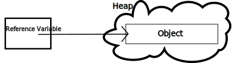

# Week 1

```java
// Basic program skeleton for FileName.java
public class FileName {
    public static void main(String[] args) {
        // Code goes here.
    }
}
```

* Every program requires a `class` containing a method called `main`.

* The name of a `class` must be identical to the name of the file.

* Java compiles to a bytecode which is then interpreted at runtime by the Java Virtual Machine (JVM).

* A `class` is an abstraction that can allow for modeling objects with their own state and methods.

* The keywork `final` is similar to `const` in C.

* In typical Java source code, variable names are in camelCase, while method names are in PascalCase.

* The default type for the literal `5` is `int`, while the default type for `3.14` is `double` (like in C).

* Similar suffixes can be used to change the type of a literal, such as `3.14f` being a `float` type.

* Adding strings concatenates them. Adding other types to a string converts them into a string and concatenates.

* Type casts take precendence over arithmetic operators. Hence, for example, `(double)5/2` evaluates to `2.5`.

* Object variables are called "reference variables" in Java, and hold an address to the actual object on the heap.


* The `new` operator is used to instantiate a class, which calls the constructor.

* The `String` class does not need to be instantiated with `new` in Java.

* To invoke an object's method `methodName()` given a reference `obj` to an instance of the object, we write `obj.methodName()`.

* One example already used in previous code is `System.out.println()`, which calls the `println()` method of the `PrintStream` instance `out` which is itself a member of `System`.

* When the assignment operator is used, such as `newVar = oldVar`, the value stored in `oldVar` is copied into `newVar`. When `newVar` and `oldVar` are reference variables, the address of the object being referenced is copied rather than a new instance being created. This is called an `alias`.

* For example,

```java
String oldVar = "Old String";
String newVar = oldVar;
newVar = "New String";

System.out.print(oldVar); // This prints "New String"
```

* Java is a garbage-collected language. This means that when a reference variable is changed to point to a new object instance, if the old instance is no longer pointed to by any reference variable, it is freed by the JVM. This is unlike a language like C where memory must be managed manually.

* Terminal input may be handled by the `Scanner` class, which requires importing `java.util.Scanner`. This class has methods such as `nextInt()`, `nextDouble()`, and `next()`, which return an `int`, a `double`, and a `String`. More methods can be found in the [docs](https://docs.oracle.com/en/java/javase/22/docs/api/java.base/java/util/Scanner.html).

* When handling an invalid input to a `Scanner`, use the `nextLine()` method to clear out the incorrect input, as errors move the `Scanner` cursor back to its initial position.

* When formatting is required for output, `System.out.printf` can be used, and it seems to have similar format specifiers as C.

* Java has the usual `if`, `else`, `else if`, and `switch` statements. Similarly, there are the usual relational operators, `<, <=, >, >=, ==`, as well as the logical operators `&&, ||, !` with their usual meanings, precedences, and short-circuit behavior.

* Like with pointers in C, using the `==` operator with reference variables only compares if they're aliases. For a class like `String`, there is a method `equals()` which tests equality.

* For `<, <=, >, >=`, there is the `compareTo()` method, where `x.compareTo(y)` returns 0 if `x.equals(y)`, a positive integer if `x` comes lexicographically after `y`, and a negative integer if `x` comes lexicographically before `y`.

* The `switch` statement can be used with values that evaluate to one of these types:
    * char
    * byte
    * short
    * int
    * String
    * enum
    * Character
    * Byte
    * Short
    * Integer

* Java also has the typical iteration statements, `for`, `while`, `do-while`.