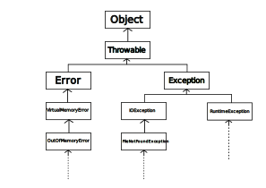

# Week 4

* An exception represents an error that occurs at runtime, and is a disruption of the normal flow of execution is response to "exceptional events" that occur at runtime.

* In Java, there are many types of exceptions that can crop up when something happens at runtime. Here are a few:
    * `NullPointerException` - Thrown when an application attempts to use null in a case where an object is required.
    * `ArrayIndexOutOfBoundsException` - Thrown when an array is attempted to be indexed out of bounds.
    * `StringIndexOutOfBoundsException` - Thrown when a String is attempted to be indexed out of bounds.
    * `ArithmeticException` - Thrown when an exceptional arithmetic condition has occurred, typically division by zero.
    * `ClassCastException` - Thrown when an object is attempted to be cast to a subclass of which it is not an instance.
    * `IllegalArgumentException` - Thrown to indicate that a method has been passed an illegal or inappropriate argument.
    * `InputMisMatchException` - Thrown to indicate that a token does not match the pattern for the expected type, or is out of range for the expected type.

* In particular, an exception in Java is an object that's thrown containing information that can be used to diagnose and gracefully handle errors at runtime.

* When an unhandled exception occurs, one can see the `stack trace`. Reading the resulting strack trace from bottom to top gives the method calls between the initial call and the throwing method. For example, consider the following:
    ```
    Exception in thread "main" java.util.InputMisMatchException
    at myClass.C(anotherClass.java:107)
    at myClass.B(anotherClass.java:80)
    at myClass.A(myClass.java:45)
    at myClass.main(myClass.java:7)
    ```
    This tells us the following story:
    1. In `myClass`, the `main()` method called `A()`.
    2. The method `A()` called the `anotherClass` method `B()`.
    3. The method `B()` called `C()`.
    4. The method `C()` threw an `InputMisMatchException`.

* To handle exceptions, we use `try` and `catch` blocks.
    ```java
    try {
        // Stuff that could throw.
    } catch (ExceptionType e) {
        // Handle exception.
    }
    ```

* There is a hierarchy of exception types, so the type choices made when declaring an exception within a catch block can determine whether the block handles one kind of exception or another.



* Note that `Throwable` has `Error` and `Exception` as two different subclasses. An `Error` generally cannot be recovered from, whereas an `Exception` could potentially be recovered from gracefully without ending the entire execution.

*  We can have multiple `catch` blocks to handle different types of exceptions.
    ```java
    try {
        // Something that could throw in multiple ways.
    } catch (ExceptionType1 e) {
        // Handle Exception Type 1
    } catch (ExceptionType2 e) {
        // Handle Exception Type 2
    } catch (ExceptionType3 e) {
        // Handle Exception Type 3
    }
    ```
    Like with an `if-else if-else` chain, the first applicable `catch` block will be chosen when handling an exception.
    A `catch(Exception e)` block can act as the `else` at the end of the `if-else if` chain.

* If `ExceptionType1` is a superclass of `ExceptionType2`, there will be a compiler error, as all cases of `ExceptionType2` are already handled by `ExceptionType1`. Therefore, if coverage of an exception and any subclasses of that exception must be handled independently, order `catch` blocks from most specific to most general exception types.

* Two important methods from `Throwable` are `getMessage()`, which returns a string with details of the exception, and `printStackTrace()` which prints the `Throwable` class name and its backtrace to stderr. For more information, [check the docs](https://docs.oracle.com/en/java/javase/22/docs/api/java.base/java/lang/Throwable.html).

* We may combine multiple `catch` blocks together for when they're handled similarly. The multiple exception types are separated by a pipe (|), as in the following example:
    ```java
    try {
        // Something that could throw in multiple ways.
    } catch (ExceptionType1 | ExceptionType2 e) {
        // Handle Exception Types 1 & 2
    } catch (ExceptionType3 e) {
        // Handle Exception Type 3
    } catch (Exception e) {
        // Handle any other exceptions.
    }
    ```

* Finally, there's the `finally` block. This block is exceuted whether an exception is thrown or not, and should be included if there's any necessary clean up or anything else that must happen. For example:
    ```java
    Scanner input = new Scanner(System.in);
    boolean success = false;
    int x = 0;
    while(!success) {
        try {
            System.out.print("Enter an integer: ");
            x = input.nextInt();
            success = true;
        } catch (Exception e) {
            System.println("Try again.");
        }
        finally {
            input.nextLine();
        }
    }
    System.print("Enter a string: ");
    String str = input.nextLine();
    System.out.println("2 times " + x " = " + 2*x + ".");
    System.out.println("Your string was \"" + str + "\"");
    ```
    In this case, whether we hit an exception or not, we'd need to run `input.nextLine()` so that the next call to the `Scanner` would execute as expected.

* As with any other class, we may define our own exceptions, and even extend other exceptions with this. When using exceptions, one uses the `throw` operator to construct the exception.

* To use files in Java, packages such as `java.io.File` and `java.io.FileNotFoundException` are needed.

* To open a file to read, we construct a `Scanner` with a `File` instead of `System.in`.

* When attempting to scan from a file, there *must* be either a `try-catch` to handle `FileNotFoundException`, or the header of the function using the file must have `throws FileNotFoundException`, for example:
    ```java
    public static void main(String[] args) throws FileNotFoundException {
        // File stuff in here.
    }
    ```

* When writing to a file, the `PrintWriter` class is used.

* When reading from structured files, such as a CSV (comma-separated values) file, the `split()` method of the `String` class can be helpful. For example, the following code will take data from a CSV file and output each value on separate lines:
    ```java
    String fileContents = getFileContents(fileName);
    String[] tokens = fileContents.split("\n");

    for (String t : tokens) {
        System.out.println(t);
    }
    ```

* The `split()` method can even use regular expressions to define delimiters.

* The `Scanner` class has a `useDelimiter()` method which takes a string like the `split()` method of `String` and automatically parses using it.